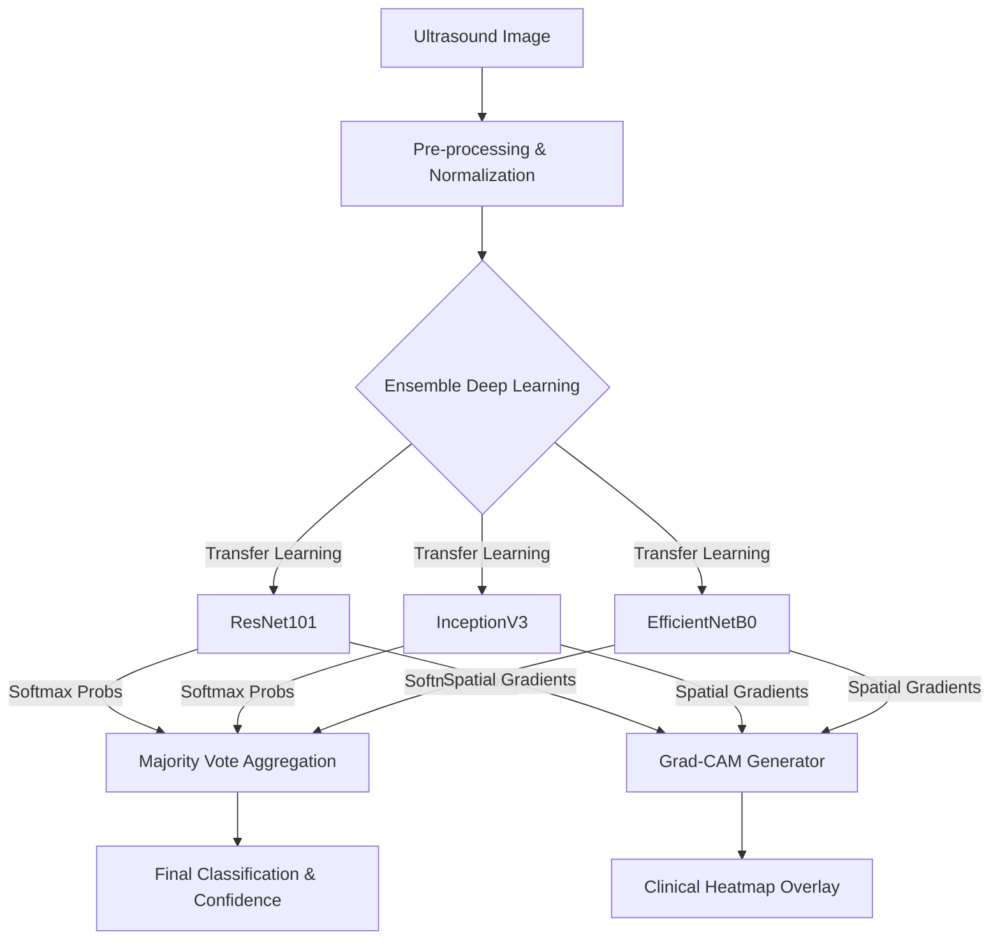
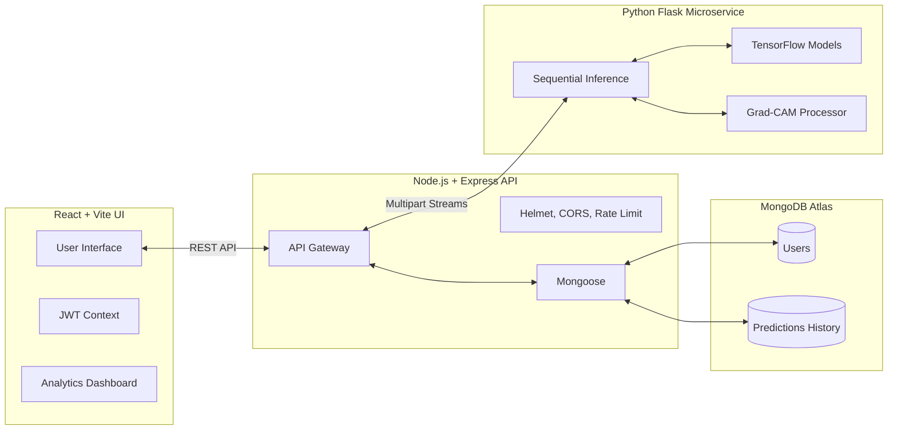

# MedAI Diagnostics: Breast Cancer Ultrasound Classification

[](https://ieeexplore.ieee.org/document/11368083)
[](https://opensource.org/licenses/MIT)
[](https://reactjs.org/)
[](https://www.tensorflow.org/)
[](https://www.mongodb.com/)

An AI-powered clinical decision support tool for breast cancer classification from ultrasound imaging using a state-of-the-art deep learning ensemble.

---

## 🎯 Overview

Breast cancer is one of the most common cancers worldwide. Early and accurate diagnosis is critical, yet manual ultrasound analysis is time-consuming, subjective, and highly dependent on radiologist expertise. **MedAI Diagnostics** aims to bridge this gap by providing a fast, reproducible, and explainable AI second opinion.

Our system classifies ultrasound images into three categories:
- **Benign**
- **Malignant**
- **Normal**

### 📚 Official Academic Publication
This repository contains the source code for our peer-reviewed research published in IEEE Xplore. Read our findings here:  
**[Enhancing Breast Cancer Prediction in HER Health with XAI Technology and ResNet101](https://ieeexplore.ieee.org/document/11368083)**

---

## 🧠 Machine Learning Architecture

The AI engine utilizes a powerful **Majority-Vote Ensemble** of three diverse Convolutional Neural Networks (CNNs). By aggregating the predictions of ResNet101, InceptionV3, and EfficientNetB0, the system compensates for individual model weaknesses, achieving an exceptionally robust **94% accuracy** on the BUSI dataset.

Furthermore, we utilize **Explainable AI (XAI)** via Grad-CAM (Gradient-weighted Class Activation Mapping). This generates a heatmap highlighting the exact regions of the ultrasound image that drove the AI's prediction, providing clinical transparency.



---

## 💻 Full Stack System Architecture

The software architecture is built on the modern MERN stack with a dedicated Python microservice handling heavy computational inference dynamically.



---

## 🛠️ Tech Stack
- **Frontend:** React, TypeScript, Vite, Tailwind-inspired CSS, Recharts, Framer Motion
- **Backend:** Node.js, Express, JWT Authentication, Bcrypt
- **Database:** MongoDB Atlas (Cloud)
- **AI & Inference:** Python, Flask, TensorFlow, Keras, OpenCV, NumPy

---

## 👥 Roles & Contributions

| Contributor | Core Role | Focus Areas |
| :--- | :--- | :--- |
| **Mohit Patil** | Full Stack (SWE) | Frontend UI, Node.js API, MongoDB, Cloud Deployment, Security, React Architecture |
| **S R Sreeram** | AI / ML Engineer | Deep Learning, Model Training, Ensemble Pipeline, Grad-CAM XAI, Python Inference |

### Detailed Contribution Logs
For an in-depth breakdown of individual contributions, please review our detailed logs:
- 🧑‍💻 [Read Mohit's SWE Contributions](contributions/mohit.md)
- 🧠 [Read Sreeram's ML Contributions](contributions/sreeram.md)

---

## 🚀 Setup & Installation (Local Development)

### 1. Database Setup
Create a `backend/.env` file with your MongoDB URI and secrets:
```env
MONGO_URI=mongodb+srv://<user>:<password>@cluster.mongodb.net/medai
JWT_SECRET=your_super_secret_key
PORT=3001
PYTHON_API_URL=http://localhost:5001
FRONTEND_URL=http://localhost:5173
```

### 2. Run the AI Inference Engine
```bash
cd model_inference
pip install -r requirements.txt
python split_models.py join   # Reassembles chunks into full .keras models
python app.py
```

### 3. Run the Node.js Backend
```bash
cd backend
npm install
npm run dev
```

### 4. Run the React Frontend
```bash
cd frontend
npm install
npm run dev
```

Visit `http://localhost:5173` in your browser.

---

> **Medical Disclaimer:** This tool is developed as an academic research prototype. It is NOT a certified medical device and must not be used as a substitute for professional medical advice, diagnosis, or treatment. Always consult a qualified healthcare professional.
